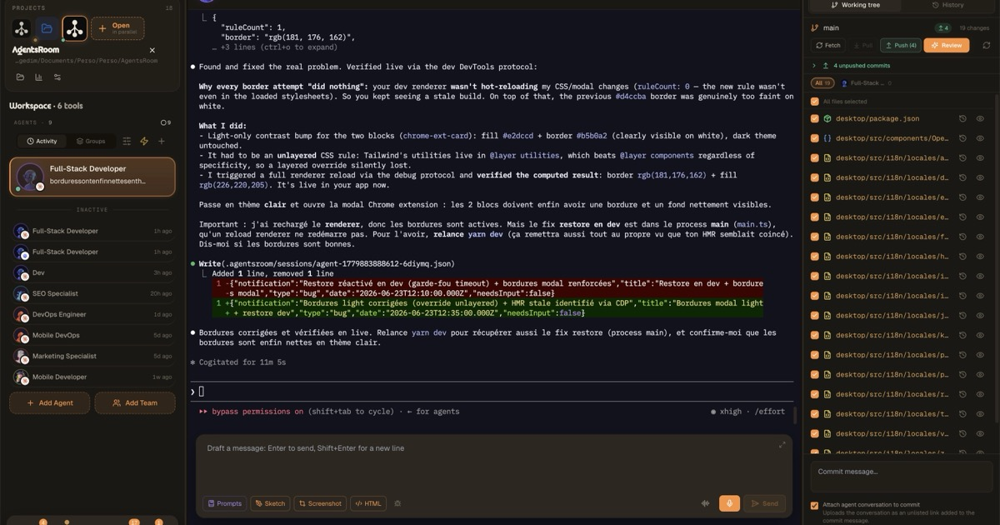
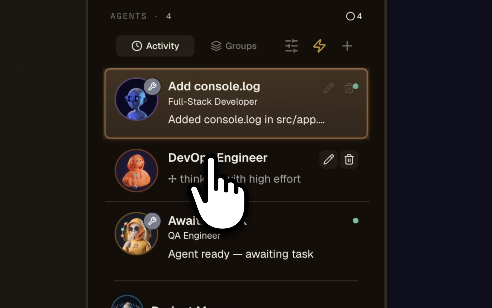
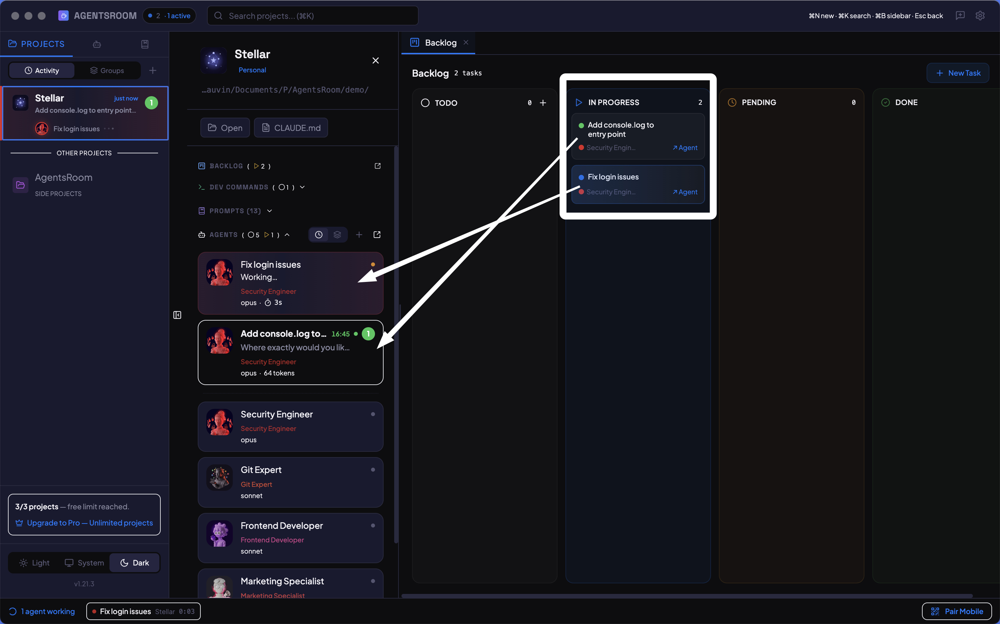
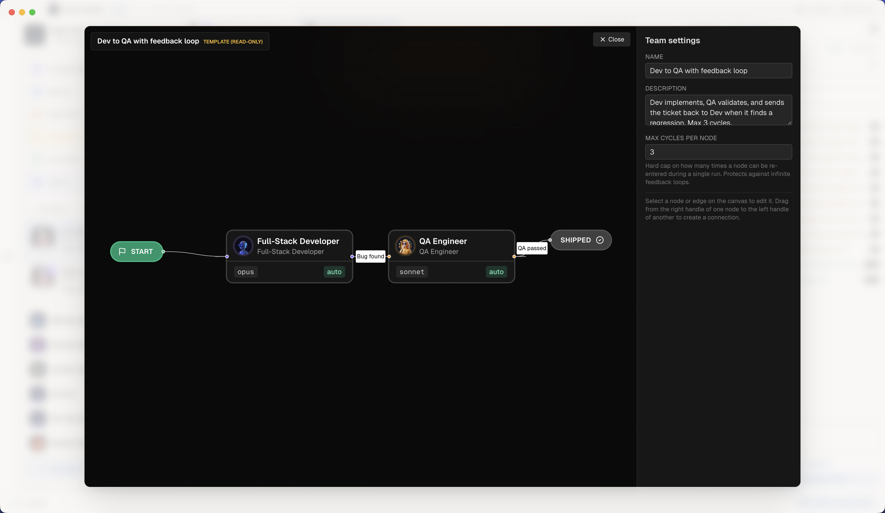
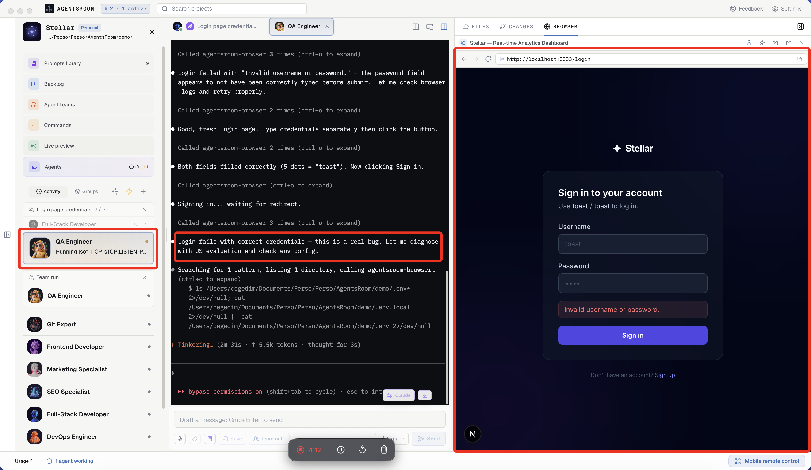
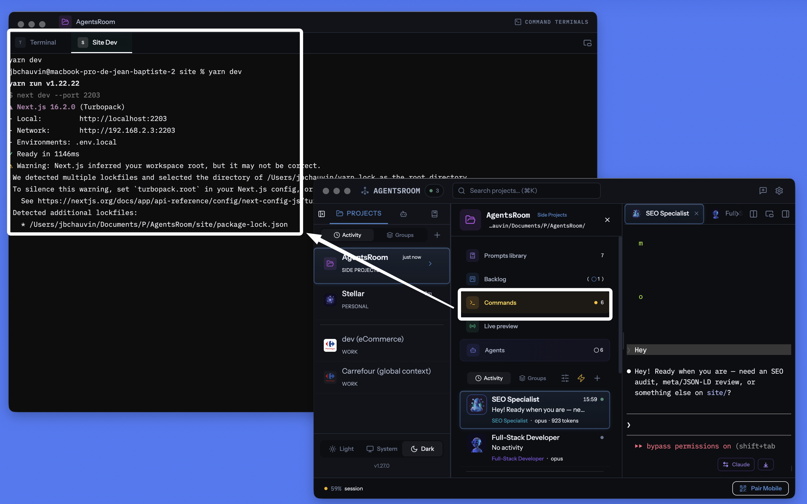
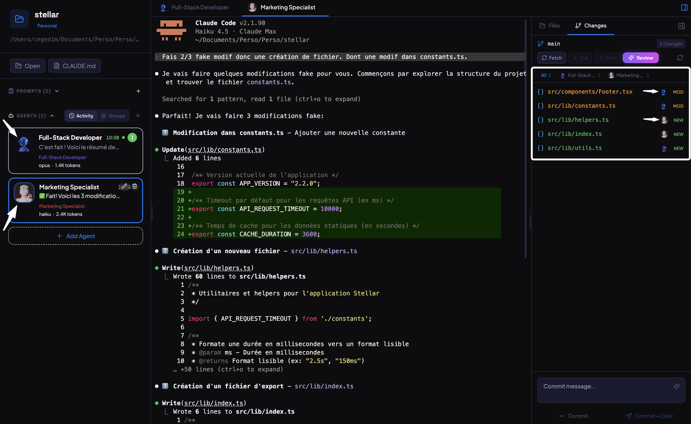
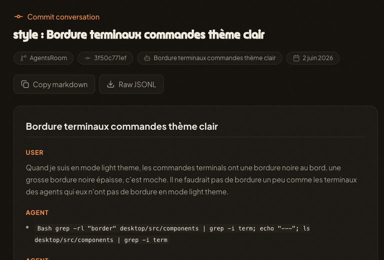
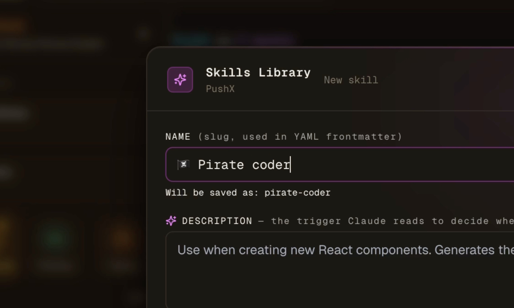

# AgentsRoom 产品调研

日期：2026-06-24

范围：调研 AgentsRoom 的页面布局、核心功能、交互逻辑、主要面板，以及它对“构建一个 AgentsRoom-like 多 Agent 工作台”的实现启发。

## 一句话结论

AgentsRoom 不是一个简单的 `/loop` 命令，也不是一个“重复输入 prompt”的工具。它更像是一个面向 AI 编程 Agent 的桌面 IDE 壳子：

```text
项目 / 房间
  -> Agent 会话
    -> 独立 PTY Terminal
    -> 角色 / Provider / Model / 状态
    -> Backlog 任务 / Team 工作流 / 手动 prompt
    -> Diff / Review / Commit / Commit Context
```

它的核心价值不是让某一个 Agent 更聪明，而是让多个真实 CLI Agent 的并行工作变得可见、可控、可恢复、可审查。

对于我们要做的系统，最重要的启发是：

- 外层应该是一个调度和观察系统。
- 底层应该跑真实的 Claude Code / Codex / Gemini CLI 等 terminal session。
- Spec、Plan、Task、Run、Diff、Commit 都应该是持久化状态。
- 不应该把系统理解成“无限循环 prompt”，而应该理解成“有状态的多 Agent 工作台”。

## 调研来源

- [AgentsRoom 首页](https://agentsroom.dev/zh)
- [功能总览](https://agentsroom.dev/zh/features)
- [多项目多智能体](https://agentsroom.dev/zh/features/multi-project-multi-agent)
- [Backlog Task Board](https://agentsroom.dev/zh/features/backlog-task-board)
- [Agent Teams](https://agentsroom.dev/zh/features/teams)
- [Dev Terminals](https://agentsroom.dev/zh/features/dev-terminals)
- [Per-Agent Review](https://agentsroom.dev/zh/features/per-agent-review)
- [Commit Context](https://agentsroom.dev/zh/features/commit-context)
- [AgentsRoom MCP](https://agentsroom.dev/zh/features/agentsroom-mcp)
- [Browser Automation](https://agentsroom.dev/zh/features/browser-automation)
- [Prompt Library](https://agentsroom.dev/zh/features/prompt-library)
- [Skills Library](https://agentsroom.dev/zh/features/skills-library)
- [Scratchpad](https://agentsroom.dev/zh/features/scratchpad)
- [Restore Session](https://agentsroom.dev/zh/features/restore-session)
- [Mobile Sync](https://agentsroom.dev/zh/features/mobile-desktop-sync)

## 官方图片素材

以下图片均为从 AgentsRoom 官网下载的公开素材，用于产品研究和界面拆解。

### 主界面总览



从这张图可以确认：

- 左侧是项目和 Agent 列表。
- 中间是当前 Agent 的 Terminal 输出和 prompt 输入区。
- 右侧是 Git / Review 面板，包括 working tree、branch、push/review、文件变更、commit message、是否附加 agent conversation。
- 整体是典型三栏 IDE 结构，不是单纯聊天窗口。

### 多项目多 Agent 驾驶舱



官网说明确认：

- 项目可以按 zone 分组。
- 每个项目可以有多个 Agent。
- 每个 Agent 有角色、头像、颜色、provider、system prompt、状态。
- PTY session 在项目切换后仍然保留。
- 大型任务可以让每个 Agent 运行在独立 git worktree / branch 中。

### Backlog 任务板



官网说明确认：

- Backlog 是四列看板：TODO、In Progress、Pending、Done。
- 把任务卡从 TODO 拖到 In Progress，会立即启动一个临时 Agent。
- Agent 的 prompt 来自任务卡标题和描述。
- 任务卡可以附加截图、原型、设计图。
- 完成后进入 diff review，再决定是否 Done。

### Agent Teams 工作流



官网说明确认：

- Team 是一个可视化 workflow canvas，类似 n8n / React Flow。
- 节点是 Agent，每个节点有角色、provider、model、instructions。
- 边是 handoff，支持条件判断，例如 `qaPassed`。
- 支持 Dev -> QA -> Dev 的反馈循环。
- 有 max-cycle guard，默认 3 次，避免无限循环。

### Browser Automation



官网说明确认：

- 每个项目可以有一个内嵌 Chromium browser。
- browser 状态按项目隔离，包括 cookies、localStorage、sessionStorage。
- Agent 可以通过 Browser MCP 控制浏览器：navigate、click、type、screenshot、evaluate、读取 logs、获取页面状态。
- 主要用途是让 QA Agent 真实验证 localhost 页面，而不是只看代码。

### Dev Terminals



官网说明确认：

- Dev Terminals 是项目级命令管理器。
- 命令保存在 `.agentsroom/commands.json`。
- 可以管理 frontend、backend、worker、database、build log 等长期进程。
- 支持 tab、split pane、detachable terminal、移动端启动、进程状态显示。

### Per-Agent Review



官网说明确认：

- Review 面板可以按 Agent 过滤 changed files。
- 顶部有每个 Agent 的 tab，显示头像、名称、文件数量。
- 文件归因结合 terminal output 解析和 git snapshot diff。
- 可以只提交某个 Agent 改动的文件。
- 多个 Agent 修改同一个文件时，会显示多重归因。

### Commit Context



官网说明确认：

- commit 时可以捕捉本次 Agent 对话。
- 对话会上传为 unlisted gist-like artifact。
- commit message 会附加 `Agent-Conversation` trailer。
- 上传前会尽力 redaction API key、token、`.env` 等敏感信息。
- 目标是保存“为什么这么改”，而不只是保存 diff。

### Skills Library



官网说明确认：

- Skill 使用 Claude `SKILL.md` 风格。
- Skill 可以附加到任务或 Agent。
- 任务启动时，skill 内容可以注入 Agent 的第一条消息。
- 支持导出到 Claude Code、Cursor、Windsurf、Codex、Aider、通用 Markdown。

## 产品定位

AgentsRoom 要解决的问题是：当你同时启动很多 AI 编程 Agent 时，普通 terminal / tmux / iTerm / Warp 会快速失控。

典型问题：

- 不知道哪个 terminal 对应哪个项目。
- 不知道哪个 Agent 是 Backend，哪个是 Frontend，哪个是 QA。
- 不知道谁已经完成、谁卡住、谁在等你输入。
- 多个 Agent 同时改代码后，很难知道每个 Agent 改了哪些文件。
- Agent 完成后缺少 review、commit、context handoff 的闭环。

AgentsRoom 的答案是：

- 一个窗口看所有项目。
- 一个项目下可以有多个 Agent。
- 每个 Agent 是一个真实 CLI session。
- 每个 Agent 有角色、头像、颜色、状态。
- 所有输出都保留在 terminal。
- 所有代码改动进入 review 和 commit 面板。
- Backlog、Team workflow、Prompt Library、Skills Library 都围绕这个核心工作台服务。

## 官网页面布局

官网本身是典型 SaaS 产品页结构：

- 顶部导航：Logo、演示、功能、Resources、在线演示、下载、语言切换。
- Hero 区：强调“所有 Agent 一个屏幕”。
- 产品截图：展示三栏 app shell。
- 功能区：按 Orchestration、Communication、Monitoring、Review & Quality、Development Environment、Everywhere 分类。
- 功能详情页：每个 feature 单独页面，包含 hero、视频/截图、说明、how it works、FAQ、CTA。

官网不是重点。真正值得复制的是 app 内部的信息架构。

## App 主界面布局

从官方截图和功能页推断，AgentsRoom 的桌面 App 是三栏工作台。

### 左栏：项目和 Agent 控制区

包含：

- Projects 列表。
- Zone 分组，例如 Work、Personal、Side Projects。
- 当前项目卡片。
- 项目路径。
- 项目快捷操作。
- 活跃 Agent 列表。
- 非活跃 Agent 列表。
- Agent 头像、角色、状态、最近活动。
- `Add Agent`。
- `Add Team`。

Agent 列表顶部还有：

- `Activity`。
- `Groups`。
- 筛选 / 调整按钮。
- 快速启动按钮。
- `+` 新建按钮。

Agent 卡片中通常包含：

- 角色头像。
- 角色名称。
- provider / model 信息。
- 当前状态文本。
- 最近活跃时间。
- edit / delete 操作。
- unread / done / waiting 指示。

### 中栏：当前 Agent Terminal

包含：

- 当前选中 Agent 的 terminal output。
- CLI 的真实输出流。
- 工具调用结果。
- 命令执行结果。
- 代码 diff 片段。
- permission / mode / effort 状态。
- 多行 prompt composer。
- 发送按钮。
- Prompt、Sketch、Screenshot、HTML、附件、语音等快捷按钮。

这一栏说明：AgentsRoom 没有把 Agent 完全抽象成聊天机器人。它仍然保留 terminal 作为主要工作表面。

### 右栏：Git / Review / Files 面板

包含：

- `Working tree`。
- `History`。
- 当前 branch。
- fetch / pull / push。
- review。
- changed files。
- staged / unstaged 状态。
- per-file review 标记。
- commit message。
- attach agent conversation to commit。

右侧面板是 AgentsRoom 的关键：它把 Agent 的 terminal 结果转成可以 review 和 commit 的工程工作流。

## 面板清单

如果要复刻一个 AgentsRoom-like 产品，至少需要理解这些面板。

### 1. Project Sidebar

作用：

- 管理多个项目。
- 按 zone 分组。
- 显示每个项目的活跃 Agent 数、完成数、卡住数。
- 快速切换项目。

关键状态：

```text
projectId
name
path
zone
activeAgentCount
doneAgentCount
blockedAgentCount
lastActivityAt
```

### 2. Agent Sidebar

作用：

- 显示当前项目下所有 Agent。
- 展示 Agent 身份、角色、状态。
- 选择当前 terminal。
- 新建 Agent 或 Team。

关键状态：

```text
agentId
projectId
role
avatar
color
provider
model
status
currentTaskId
lastActivityAt
ptyId
```

### 3. Agent Terminal

作用：

- 承载真实 CLI Agent session。
- 显示 terminal 输出。
- 输入 prompt。
- 保留长期上下文。

关键点：

- 应该是真 PTY，不是普通 stdout buffer。
- 需要支持 resize。
- 需要支持 send text。
- 需要记录 transcript。
- 需要从输出中解析状态。

### 4. Prompt Composer / Scratchpad

作用：

- 多行编辑 prompt。
- 避免在 terminal 中写长 prompt 的体验问题。
- 支持 autosave。
- 支持保存到 Prompt Library。

交互：

- Enter 换行。
- Cmd+Enter / Ctrl+Enter 发送。
- 可以插入截图、sketch、HTML、prompt template。

### 5. Backlog Board

作用：

- 将需求转为任务。
- 任务状态可视化。
- 任务可以直接启动 Agent。

列：

```text
TODO
In Progress
Pending
Done
```

关键交互：

- 新建任务。
- 附加截图/设计/说明。
- 指定 Agent 角色。
- 拖到 In Progress 后自动启动 Agent。
- Agent 状态同步到任务卡。
- 完成后进入 diff review。

### 6. Teams Canvas

作用：

- 定义多 Agent 工作流。
- 让 Agent 之间通过结构化 handoff 协作。

元素：

```text
Team
Node(agent role/provider/model/instructions)
Edge(condition/handoff)
Run
Timeline
SharedNotes
Inbox
```

典型流程：

```text
Dev Agent
  -> QA Agent
    -> 如果 qaPassed=true，结束
    -> 如果 qaPassed=false，回到 Dev Agent
```

### 7. Dev Terminals

作用：

- 管理非 Agent 的项目命令。
- 启动 dev server、worker、数据库、本地服务。

关键区别：

```text
Agent PTY != Dev Server PTY != One-shot Command
```

它们都可能是 terminal，但生命周期和 UI 语义不同。

### 8. Browser Panel

作用：

- 内嵌 Chromium。
- 让 Agent 做真实浏览器验证。
- 保存项目级 browser state。

MCP 能力：

```text
browser_navigate
browser_click
browser_type
browser_screenshot
browser_evaluate
browser_get_logs
browser_get_state
```

### 9. Review / Diff Panel

作用：

- 看 Agent 改了什么。
- 按文件 review。
- 按 Agent 过滤 diff。
- 支持 scoped commit。

关键状态：

```text
filePath
status
changedByAgentIds
reviewed
staged
diff
```

### 10. Commit Panel

作用：

- 输入 commit message。
- 选择是否附加 agent conversation。
- 提交全部或部分文件。
- 保存 Agent 运行上下文。

建议我们自己的 commit message metadata：

```text
Task: <task-id>
Plan-Step: <plan-step-id>
Agent-Run: <run-id>
Agent-Conversation: <transcript-path-or-url>
Verification: <pass/fail>
```

### 11. Prompt Library

作用：

- 保存可复用 prompt。
- 按项目和个人区分。

AgentsRoom 使用：

```text
.agentsroom/prompts.json
.agentsroom/prompts-personal.json
```

个人 prompt 文件会 gitignore。

### 12. Skills Library

作用：

- 管理可复用技能。
- 附加到任务或 Agent。
- 启动时注入 Agent。

导出目标：

```text
Claude Code: .claude/skills/<name>/SKILL.md
Cursor: .cursor/rules/<name>.mdc
Windsurf: .windsurf/rules/<name>.md
Codex: AGENTS.md managed block
Aider: CONVENTIONS.md managed block
Generic: <name>.md
```

### 13. Status / Notification Layer

作用：

- 显示 Agent 是否在思考、完成、等待输入、卡住。
- 桌面通知。
- mobile push。
- dock badge。
- Dynamic Island 类状态提示。

这是多 Agent 产品中很关键但容易被低估的一层。

### 14. Restore Session

作用：

- App 退出后恢复工作台。
- 还原 Agent、dev server、terminal command、工作目录。

需要保存：

```text
agent role
provider
project
working dir
process class
command line
rollback intent
terminal session metadata
```

## 核心交互逻辑

### 交互 1：启动一个 Agent

```text
选择项目
  -> Add Agent
  -> 选择角色 / provider / model
  -> 创建 PTY session
  -> 在项目目录启动真实 CLI
  -> 左侧显示 Agent 状态
  -> 中央显示 terminal
```

这里的关键是：Agent 不是一个数据库记录而已，它背后有真实进程和 terminal。

### 交互 2：用户给 Agent 发任务

```text
选中 Agent
  -> 在 Scratchpad / Composer 写 prompt
  -> 点击 Send
  -> prompt 写入 PTY
  -> terminal 输出开始流式更新
  -> 状态从 idle 变为 thinking / working
```

### 交互 3：Backlog 启动 Agent

```text
创建任务卡
  -> 任务卡放在 TODO
  -> 拖到 In Progress
  -> 自动创建临时 Agent
  -> 把任务标题/描述作为 prompt
  -> 打开 terminal
  -> 任务卡显示 Agent 状态
  -> 完成后进入 Review
```

这对我们特别重要。我们的 spec/plan 文件可以先转成任务卡，再由任务卡触发 executor agent。

### 交互 4：Team 工作流 handoff

```text
启动 Team Run
  -> 第一个 Agent 工作
  -> Agent complete step
  -> 生成 handoff payload
  -> 下一个 Agent 收到摘要和上下文
  -> 根据 flags 决定走哪条边
  -> 到达终止节点或触发 max-cycle
```

Handoff payload 可能包含：

```text
feature summary
changed files
touched areas
risks
test hints
flags
```

### 交互 5：Review 和 Commit

```text
Agent 完成
  -> 系统刷新 git diff
  -> 右侧显示 changed files
  -> 可按 Agent 过滤
  -> 用户 review 文件
  -> 输入 commit message
  -> 可选择附加 conversation context
  -> commit
```

这个流程说明：Agent 的 done 只是一个信号，不等于代码可以直接合并。

### 交互 6：Browser 验证

```text
启动 dev server
  -> 打开项目 Browser
  -> Agent 通过 MCP 控制浏览器
  -> 点击/输入/截图/读取 console
  -> 验证功能
  -> 把验证结果写回任务或 terminal
```

这可以作为后续增强。MVP 不一定要先做。

## 功能模块拆解

### Multi-Project / Multi-Agent

确认功能：

- 一个窗口跨多个项目。
- 每个项目多个 Agent。
- 每个 Agent 一个隔离 PTY session。
- Agent 有角色、头像、颜色、system prompt、provider。
- 状态实时更新。
- 项目级计数显示 working / done / stuck。
- 支持原生桌面通知和移动通知。
- 支持每个 Agent 独立 worktree。

可复制重点：

- 项目和 Agent 是一等对象。
- PTY session 是一等对象。
- 状态不是靠用户填，而是从 terminal 输出和进程状态中解析。

### Backlog Task Board

确认功能：

- 看板任务驱动 Agent。
- 拖卡启动 Agent。
- 任务卡可以附图。
- 卡片显示实时 Agent 状态。
- review 后才 Done。

可复制重点：

- Plan step 可以映射为 task。
- Task 状态变化可以触发 agent run。
- Task 不是纯记录，它是执行入口。

### Agent Teams

确认功能：

- 可视化多 Agent workflow。
- 节点是 Agent。
- 边是 handoff。
- 支持条件分支。
- 支持 Dev / QA 循环。
- 支持共享 NOTES.md、role inbox、timeline。
- 支持 manual handoff 和 automatic handoff。

可复制重点：

- 多 Agent 协作应该通过显式 handoff payload，而不是让所有 Agent 共享一个混乱上下文。
- 应该有 max-cycle，避免无限循环。

### Dev Terminals

确认功能：

- 项目级命令管理。
- 命令保存在 `.agentsroom/commands.json`。
- 支持 start all。
- 支持 detached terminal。
- 支持远程启动。
- 支持 AI 生成命令。

可复制重点：

- 需要单独建模 dev server / command session。
- 它和 coding agent session 不是同一类对象。

### Browser Automation

确认功能：

- 项目级浏览器。
- Browser MCP。
- Agent 可以真实操作网页。
- 可以读取 screenshot、logs、state。

可复制重点：

- 验证闭环最好最终接入 browser。
- 但 MVP 可以先只做 shell command verification。

### Review / Per-Agent Commit

确认功能：

- 按 Agent 过滤 diff。
- 文件归因来自 terminal output 和 git snapshot。
- 可以只 commit 某个 Agent 的文件。
- 多 Agent 修改同一文件会显示多重归因。

可复制重点：

- 每个 agent run 开始前要记录 git baseline。
- 每个 agent run 结束后要保存 diff。
- 文件归因不能只靠最终 git diff。

### Commit Context

确认功能：

- commit 时附加 agent conversation。
- 生成 unlisted gist-like 链接。
- commit message 加 `Agent-Conversation` trailer。
- 上传前 redaction secrets。

可复制重点：

- 自动 commit 时必须保存上下文。
- 不然下一个 agent 或人类 reviewer 很难知道为什么这样改。

### Prompt Library

确认功能：

- 项目 prompt 文件。
- 个人 prompt 文件。
- 个人 prompt gitignore。
- 搜索、文件夹、标签、发送到 active agent。

可复制重点：

- Planner / Executor / Reviewer 的启动 prompt 应该模板化。
- 不要每次手写。

### Skills Library

确认功能：

- 使用 `SKILL.md` 风格。
- 可附加到任务或 Agent。
- 可导出到多个 IDE/CLI agent 环境。

可复制重点：

- 我们不应该重写 Codex / Claude 的 superpowers 插件。
- 应该让外壳负责“什么时候启动哪个 Agent，并给它什么上下文”。
- 技能本身由现有 Agent runtime 消费。

## 与我们需求的对应关系

用户想要三个 loop：

```text
Loop 1: docs product intent
  用户或 agent 做调研，维护目标文件。

Loop 2: planner
  观察 docs/research、docs/superworks/spec、docs/superworks/plans，生成和修订自洽 plan。

Loop 3: executor
  根据 plan 修改代码，验证，commit，提醒是否 PR。
```

AgentsRoom 给出的产品级答案是：

```text
不要只做 loop。
要做一个状态化工作台。

docs/research 和 docs/superworks/spec 是输入源。
docs/superworks/plans 是可验证任务来源。
task 是调度单位。
agent session 是执行单位。
PTY 是运行载体。
diff/review 是质量门。
commit context 是记忆和交接。
```

也就是说：

- `/loop` 只是一个重复触发机制。
- AgentsRoom-like 系统应该是一个 orchestrator。
- orchestrator 调度真实 terminal agent，而不是替代 agent。
- Codex / Claude 的 spec/plan/superpowers 插件可以继续用。
- 外壳只负责启动、观察、记录、路由、提交、通知。

## 推荐 MVP

第一版不要做完整 AgentsRoom。建议先做 5 个面板。

### MVP 面板 1：Project / Agent Sidebar

最小功能：

- 添加项目路径。
- 显示项目列表。
- 每个项目显示 Agent 数量和状态。
- 添加 Agent。
- 切换 Agent。

### MVP 面板 2：PTY Terminal + Prompt Composer

最小功能：

- 启动 Claude Code / Codex CLI。
- 保持真实 PTY。
- 显示 terminal 输出。
- 多行 prompt 输入。
- 发送 prompt 到当前 PTY。
- 保存 transcript。

### MVP 面板 3：Research / Spec / Plan Watcher

最小功能：

- 监听 `docs/research/`、`docs/superworks/spec/`、`docs/superworks/plans/`。
- 文件变化后创建 planner task。
- 启动 planner Agent。
- planner Agent 使用现有 Codex/Claude spec/plan 插件。
- 生成或更新 plan 文件。
- 校验 plan steps 是否合理、可验证。

### MVP 面板 4：Task Queue / Backlog

最小功能：

- 将 plan step 映射为 task。
- task 有状态：TODO、Running、Blocked、Done。
- Running 时启动 executor Agent。
- task 绑定 agent run。

### MVP 面板 5：Git Review / Commit

最小功能：

- 显示 git status。
- 显示 diff。
- 保存 agent run 的 baseline 和最终 diff。
- 允许 commit。
- commit message 带 task id、plan step id、run id、transcript path。
- commit 后提醒是否创建 PR。

## 建议数据模型

### Project

```json
{
  "id": "project-id",
  "name": "Agent Workspace",
  "path": "/path/to/repo",
  "zone": "work",
  "createdAt": "2026-06-24T00:00:00Z",
  "lastActivityAt": "2026-06-24T00:00:00Z"
}
```

### AgentSession

```json
{
  "id": "agent-session-id",
  "projectId": "project-id",
  "role": "executor",
  "provider": "codex",
  "command": "codex",
  "cwd": "/path/to/repo",
  "ptyId": "pty-id",
  "status": "running",
  "currentTaskId": "task-id",
  "createdAt": "2026-06-24T00:00:00Z",
  "lastActivityAt": "2026-06-24T00:00:00Z"
}
```

### Task

```json
{
  "id": "task-id",
  "projectId": "project-id",
  "source": "plan-step",
  "planFile": "docs/superworks/plans/feature.plan.md",
  "planStepId": "step-3",
  "title": "Implement executor loop",
  "description": "Run code edits based on validated plan step",
  "status": "todo",
  "assignedRole": "executor",
  "runIds": []
}
```

### AgentRun

```json
{
  "id": "run-id",
  "agentSessionId": "agent-session-id",
  "taskId": "task-id",
  "projectId": "project-id",
  "startGitSha": "abc123",
  "startStatus": "...",
  "promptPath": ".agent-workspace/runs/run-id/prompt.md",
  "transcriptPath": ".agent-workspace/runs/run-id/transcript.log",
  "diffPath": ".agent-workspace/runs/run-id/diff.patch",
  "verificationPath": ".agent-workspace/runs/run-id/verification.json",
  "status": "completed"
}
```

### CommitContext

```json
{
  "commitSha": "def456",
  "taskId": "task-id",
  "planStepId": "step-3",
  "agentRunId": "run-id",
  "transcriptPath": ".agent-workspace/runs/run-id/transcript.log",
  "verification": "passed"
}
```

## 建议文件结构

项目内部可以这样组织：

```text
docs/research/
  agentsroom-research-2026-06-24.zh.md

docs/superworks/spec/
  product-spec.md

docs/superworks/plans/
  executor-loop.plan.md
  planner-loop.plan.md

.agent-workspace/
  project.json
  agents.json
  sessions/
    <session-id>.json
    <session-id>.log
  tasks/
    backlog.json
  runs/
    <run-id>/
      prompt.md
      transcript.log
      diff.patch
      verification.json
      commit.json
  commands.json
  prompts.json
  skills.json
```

原则：

- 用户可读的目标内容放在 `docs/research/`、`docs/superworks/spec/`、`docs/superworks/plans/`。
- 机器调度状态放在 `.agent-workspace/`。
- 不要把运行状态和产品目标混在一起。

## 实现顺序建议

### 阶段 1：PTY Session 管理

目标：

- 能启动真实 CLI agent。
- 能向 PTY 写入 prompt。
- 能读取 PTY 输出。
- 能保存 transcript。
- 能 stop / restart session。

这是基础。没有它，所有上层 UI 都只是模拟。

### 阶段 2：项目和 Agent 工作台

目标：

- 项目列表。
- Agent 列表。
- 当前 terminal。
- prompt composer。
- 基础状态 tracking。

### 阶段 3：Git 状态和 Review 面板

目标：

- git status。
- changed files。
- diff view。
- stage / unstage。
- commit。
- run transcript 绑定 commit。

### 阶段 4：Research / Spec / Plan Watcher

目标：

- 监听 docs/research、docs/superworks/spec、docs/superworks/plans 文件。
- 创建 planner task。
- 启动 planner agent。
- 更新 plan。
- 校验 plan 是否自洽。

### 阶段 5：Executor Loop

目标：

- 从 plan step 生成 task。
- 启动 executor agent。
- 注入 spec/plan/task 上下文。
- 运行验证。
- 保存 diff 和 transcript。
- commit 或生成 commit proposal。
- 提醒是否 PR。

### 阶段 6：Backlog Board

目标：

- 可视化任务状态。
- 拖卡启动 agent。
- task 和 run 绑定。

### 阶段 7：Dev Commands

目标：

- 保存项目命令。
- 启动 dev server。
- 记录命令状态。

### 阶段 8：Browser Automation

目标：

- 内嵌 browser。
- browser MCP。
- QA agent 验证 localhost。

### 阶段 9：Teams Canvas

目标：

- 多 Agent workflow。
- handoff payload。
- max-cycle guard。
- shared notes / inbox / timeline。

## 关键设计判断

### 1. 先用真实 terminal agent，不要直接调模型 API

原因：

- Claude Code / Codex CLI 已经有自己的认证、插件、skill、MCP、工具调用、上下文机制。
- 直接跑 CLI 可以最大程度复用现有生态。
- 也更接近 AgentsRoom 的模式。

### 2. Shell 负责调度，不负责思考

Shell 应该负责：

- 选哪个项目。
- 选哪个 task。
- 选哪个 Agent。
- 用哪个 cwd / worktree。
- 注入哪个 prompt。
- 什么时候启动。
- 什么时候重试。
- 什么时候提醒用户。
- 什么时候 commit。

Agent 应该负责：

- 具体实现。
- 代码修改。
- 测试。
- 在自己的 runtime 内使用对应插件。

### 3. Plan 必须是文件，不是内存状态

Plan loop 的输出必须可读、可 diff、可审查。

每个 plan step 应该：

- 有明确目标。
- 有输入文件。
- 有输出文件。
- 有验证方式。
- 有依赖关系。
- 有完成条件。

### 4. 自动 commit 必须保留上下文

如果 executor loop 会自动 commit，那么 commit 中至少应该保存：

- task id。
- plan step id。
- agent run id。
- transcript path。
- verification result。

否则以后无法判断代码为什么这样改。

### 5. `done` 不等于可信

Agent 状态 `done` 只是 Agent 自己认为完成。真正的完成需要：

- diff 可审查。
- 验证命令通过。
- 没有明显冲突。
- commit context 完整。
- 用户或 reviewer 允许进入 PR。

## 已确认与推断

### 官网明确确认

- AgentsRoom 本地启动真实 CLI。
- 支持多个 provider。
- 每个 Agent 有隔离 PTY session。
- 一个项目可以有多个 Agent。
- 支持实时状态追踪。
- Backlog 卡片可以启动 Agent。
- Teams 用 visual workflow 和 structured handoff。
- Dev Terminals 保存项目命令。
- Browser Automation 通过 MCP 暴露。
- Review 可以按 Agent 过滤。
- Commit Context 可以把对话链接写入 commit。
- Prompt Library 和 Skills Library 是项目级能力。

### 从截图和 bundle 名称推断

- 主界面是稳定三栏布局。
- 内部状态至少包含 projects、agents、commands、prompts、teams、sessions、backlogId。
- 右侧面板可能在 working tree、history、review、file detail 间切换。
- Agent terminal 和 dev terminal 可能复用底层 terminal infrastructure，但 UI 语义不同。

## 对我们后续产品文档的建议

下一步可以把这份 research 转成两类文档：

```text
docs/superworks/spec/agentsroom-like-product-spec.md
docs/superworks/plans/build-agent-workspace-mvp.plan.md
```

Spec 应该描述：

- 用户是谁。
- 核心工作流是什么。
- 哪些 loop 是自动的。
- 哪些地方必须问用户。
- 哪些文件是 source of truth。
- 如何处理 commit / PR / failed verification。

Plan 应该拆成：

- PTY 管理。
- 项目模型。
- Agent session 模型。
- 文件 watcher。
- planner task。
- executor task。
- git review。
- commit context。
- UI shell。

## 最终结论

AgentsRoom 值得复制的不是视觉风格，而是产品结构：

```text
多项目
  + 多 Agent
  + 真实 PTY
  + 文件驱动的任务/计划
  + 可观察状态
  + review/commit 闭环
  + 上下文可恢复
```

这和用户想做的三层 loop 是一致的，但实现上不应该从 loop 开始，而应该从“多 Agent 工作台 + 文件 watcher + PTY session manager + git review”开始。

最小可行产品应该先做到：

```text
Project Sidebar
Agent Terminal
Prompt Composer
Research/Spec/Plan Watcher
Task Queue
Git Review
Commit Context
```

Browser、Teams、Mobile Sync 可以后置。
