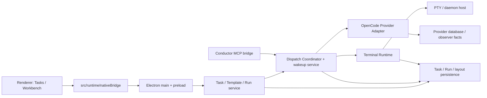

# Code Ownership and Layer Map

Date: 2026-07-29
Status: active maintenance contract
Scope: where Agent Workspace code belongs, the allowed dependency direction,
and how to add or move code without creating another implicit control plane.

## Purpose

This is not a request for a broad folder rewrite. It is the map used when a
feature or bug fix is touched: identify its owner, put new code at that owner,
and do not make a renderer, Electron entry point, terminal transport module, or
Provider observer decide another layer's business state.

The product is currently hard to reason about because the same user-visible
event travels through several independently stateful areas: Task/Run storage,
dispatch/wakeup storage, terminal-host memory, Provider observation, IPC, and
a large renderer component. The fact that those layers all exist is correct;
the absence of an explicit code map is not.

## Current code map

| Area | Current home | Owns | Must not own |
| --- | --- | --- | --- |
| Task/Template/Run application service | `desktop/runtime/agent-loop-v1-runtime.cjs`, `desktop/runtime/loop-template-store.cjs`, `desktop/runtime/task-run-repository.cjs`, `desktop/runtime/task-run-service.cjs`, `desktop/runtime/task-run-read-model.cjs`, `desktop/runtime/agent-loop-state-model.cjs`, `desktop/runtime/run-continuity.cjs` | Template identity/versions, Task snapshot, command ledger and revision, canonical lifecycle transitions, Run creation/stop/recovery projection, Timeline outbox, persisted Workbench layout, pure typed read-model projection | raw terminal bytes, Provider parsing, rendering, Conductor route choice |
| Dispatch coordination | `desktop/runtime/dispatch-coordinator.cjs`, `desktop/session-wakeup-monitor.cjs` | durable dispatch attempts, occupancy, wakeup delivery and later cancellation receipts | visual layout, business retry target, Task achieved verdict |
| Terminal Runtime | `desktop/runtime/terminal-*.cjs`, `desktop/runtime/orca-terminal-*.cjs`, `desktop/runtime/session-authority.cjs` | PTY launch/claim, incarnation, input serialization, resize, snapshot/delta/ACK, exit fact | Provider result, semantic completion, next Agent selection |
| OpenCode Provider Adapter | `desktop/opencode/*.cjs` | read-only Provider/session observation and exact receipt/result/attention facts | PTY lifecycle, retries, Task state, UI |
| Conductor capability bridge | `desktop/conductor-mcp-server.cjs`, `desktop/conductor-tool-bridge.cjs` | MCP tool schema, Task/Run scoping, forwarding validated commands to the Coordinator | direct PTY control, hidden workflow, deciding a replacement route |
| Electron composition / IPC | `desktop/main.cjs`, `desktop/preload.cjs` | process construction, capability exposure, event forwarding | domain state transitions or UI policy |
| Renderer native boundary | `src/runtime/nativeBridge.ts` | typed, narrow renderer-facing IPC calls and Runtime view types | persistent state or terminal/protocol implementation |
| Agent Loop UI | `src/agent-loop/AgentLoopApp.tsx`, `src/agent-loop/tasks/TaskConversationComposer.tsx`, `src/agent-loop/runPresentation.ts` | page state, task/template/workbench presentation, user intents, Timeline projection | deciding transport truth or starting/killing a PTY directly |
| Terminal UI | `src/components/PtyTerminal.tsx` | xterm attachment, display, normal input and resize forwarding | Task/Run lifecycle, dispatch semantics, Provider state |
| Workbench layout UI | `src/agent-loop/workbenchLayout.ts` | pure manipulation/rendering of a validated persisted layout | launching a Session or assigning business work |

The root-level files above are a map of the present repository, not an
endorsement that every responsibility is already in the ideal place. In
particular, `AgentLoopApp.tsx`, `agent-loop-v1-runtime.cjs`, and the
root-level wakeup/store/bridge files are currently too central.

## Required dependency direction



Allowed facts flow back upward as typed Runtime events and read models. The
inverse dependencies are forbidden:

- Renderer code does not import or control a desktop PTY implementation.
- `main.cjs` and `preload.cjs` do not decide recovery, achievement, routing, or
  layout policy.
- Terminal Runtime does not parse terminal text into Task results or choose an
  Agent Card.
- Provider observation does not retry a task, stop a Task, or infer delivery
  quality.
- Conductor tools do not send raw `Ctrl+C`, kill a PID, edit a worker-owned
  deliverable, or bypass the Dispatch Coordinator.

## Canonical ownership of state

Each fact has one writer and a named read model. A second cache is permitted
only when it is explicitly derived and can be rebuilt.

| Fact | Single writer | Read by |
| --- | --- | --- |
| Template version, Task Architecture, Task lifecycle, Run identity, persisted layout | Task/Template/Run service | UI, Conductor state read, Coordinator |
| Dispatch attempt, input receipt, wakeup, cancellation request/receipt | Dispatch Coordinator | Conductor, Task/Run projection, UI |
| Terminal liveness, PID, incarnation, screen/snapshot, terminal input acceptance | Terminal Runtime | Coordinator, Terminal UI |
| Exact Provider session/message/turn, result, attention, failure | Provider Adapter | Coordinator, Conductor state read |
| Selected tab, temporary panel state, unsaved form text | Renderer only | Renderer only |

The current SQLite Task/Run records, Session Store facts, and live PTY manager
must be treated as different fact stores, not competing truth for the same
field. When a new status is added—such as `recovery_required` or
`cancellation_requested`—its owner, durable record, projection, and UI read
model must be named before code is written.

The physical Session Store remains a compatibility container, but active
production composition fences it through
`desktop/runtime/session-store-capabilities.cjs`. A consumer receives only its
read-model, Timeline, Coordinator, Provider, or Terminal methods. A composite
service such as the wakeup monitor is assembled explicitly from the named
views; it is not given the raw Store and cannot call an unassigned writer.
Within that container, Terminal and Provider persist separate `terminalState`
and `providerState` fields, while Coordinator state is derived from immutable
Dispatch/Wakeup records. The generic `state` field and `recordState` method are
legacy compatibility only and must not be used by active production code.

## Where new code goes

| Change | Put the behavior here | Do not put it here |
| --- | --- | --- |
| Task-page Send / automatic continuation | Task/Run service persists the message, then delegates reattachment or replacement Host startup to Terminal Runtime and Coordinator | a separate renderer recovery action or `AgentLoopApp.tsx` branching on whether a PTY exists |
| Conductor `cancel_dispatch` | MCP schema/bridge → Dispatch Coordinator cancellation command → Terminal/Provider confirmation | direct keypress or process kill from MCP/renderer |
| Start/Stop/New Run | Task/Run service; terminal work through Session Authority | button callback implementing lifecycle rules |
| Worker dispatch, occupancy, input receipt | Dispatch Coordinator | Conductor bridge or Provider observer |
| Provider result/attention detection | `desktop/opencode/` adapter only | xterm screen parsing or UI polling |
| Terminal reconnect, snapshot, scrollback, resize, input arbitration | Terminal Runtime and `PtyTerminal` attachment code | Timeline or Task service |
| Automatic first Group placement | a pure layout allocation policy beside `workbenchLayout`, persisted by the Task/Run service | dispatch code or Template Agent Cards |
| Task Timeline wording and expansion | `runPresentation.ts` plus UI components, from durable read models | a terminal transcript parser |
| IPC type change | `src/runtime/nativeBridge.ts`, preload, then `main.cjs` adapter | ad-hoc `window` calls in a page component |

New modules should be introduced by responsibility, not as catch-all helpers.
The preferred incremental destinations are:

```text
desktop/runtime/
  loop-template-store.cjs       # Loop Template CRUD and normalization
  agent-loop-state-model.cjs    # canonical Task/Run status vocabulary
  task-run-repository.cjs       # Task/Run SQL, command ledger, revision, outbox
  task-run-service.cjs          # Task/Run lifecycle semantics
  dispatch-coordinator.cjs       # dispatch / cancellation / wakeup command state
  terminal-*.cjs                 # transport only
desktop/opencode/                # Provider facts only
desktop/conductor/               # future home for MCP server + tool bridge
src/agent-loop/
  tasks/                         # Task Timeline and composer components
  templates/                     # Template surfaces
  workbench/                     # layout policy and Workbench components
  runPresentation.ts             # pure durable-read-model → UI projection
src/components/PtyTerminal.tsx   # reusable terminal viewport only
```

The names are target homes, not a mandate to move every file now. A touched
feature should move only the smallest coherent boundary with its tests.

## Known management problems to resolve

1. **The physical Session Store still contains several owners' records.** Active
   product composition now fences consumers with owner-scoped capabilities,
   but historical harnesses still construct the raw compatibility Store. Do
   not copy that fixture pattern into production code. Physical extraction is
   still pending and must preserve one typed read model rather than introduce
   separate competing UI stores.
2. **`AgentLoopApp.tsx` is a page, controller, and mutation coordinator at
   once.** Its Task/Run cache is now semantic-invalidation driven. New Task controls should be extracted into Task,
   Template, and Workbench surface components before more lifecycle branches
   are added.
3. **`agent-loop-v1-runtime.cjs` remains a broad facade.** Task/Run SQL and
   lifecycle decisions have moved to Repository/Service, but layout, artifact,
   permission, and recovery composition still share the facade. Continue only
   with coherent owner extractions; do not turn it into a Terminal or Provider writer.
4. **Terminal and semantic state can be visually conflated.** A terminal being
   live, a Provider turn being complete, and a Task being delivery-ready are
   different facts. The read model must retain all three.
5. **Layout exists in both UI manipulation and Runtime normalization.** Keep a
   single serialized layout schema and one allocation policy. Renderer changes
   are pure proposed layouts; Runtime validates/persists them.
6. **Top-level desktop helpers hide their owner.** On the next coherent change,
   move `session-wakeup-monitor`, `session-store`, and conductor bridge files
   under their responsible namespaces with their tests. Do not do a cosmetic
   mass move.
7. **Generated work must not blur source ownership.** Runtime metadata remains
   under `.agent-workspace/`; fixtures belong under `desktop/fixtures/`; user
   research/reports and generated deliverables do not become source modules or
   test fixtures merely because they are present in the repository root.
8. **Test names need to express the boundary they prove.** Unit tests sit beside
   their owner; a cross-layer harness proves one causal path; a live OpenCode
   run proves user interaction. A UI screenshot or CSS assertion does not prove
   native terminal continuation, scroll, or cancellation.
9. **Dispatch commands do not yet have a Task/Run-style durable command
   ledger.** Existing dispatch ids and record transitions prevent several
   duplicates, but a later slice must define stable command identity,
   optimistic concurrency and restart reconciliation at the Coordinator owner.

## Change checklist

Before adding a feature, record these answers in its plan or PR description:

1. What user action and durable outcome are being added?
2. Which layer owns the decision, and which layer merely reports a fact?
3. What is the single durable record and idempotency key?
4. Does it affect Task, Run, Dispatch, Session, Provider, or only UI state?
5. Which IPC contract changes? Can the renderer use a typed read model instead
   of inferring from raw terminal data?
6. Does it preserve the dependency direction above?
7. Which unit, coordinator/terminal harness, and real native interaction test
   prove it?

## Safe migration order

1. Keep behavior stable while adding this ownership map and tests for the
   current seam.
2. Implement continuity/recovery and `cancel_dispatch` through the defined
   owners; do not also reorganize unrelated folders.
3. Extract Task, Template, and Workbench surfaces from `AgentLoopApp.tsx` as
   each receives a real feature change.
4. Keep the extracted Task/Run Repository/Service behind the existing Runtime
   facade; move another responsibility only when its behavior is being changed.
5. Relocate root-level desktop helpers only with import updates and their
   sibling tests, after the behavior is covered.
6. Delete duplicate/obsolete paths only after a traceable replacement and
   passing harnesses prove no active caller remains.

This order is intentionally incremental. A directory migration without a
behavioral boundary would create churn while leaving the real ownership problem
unchanged.
